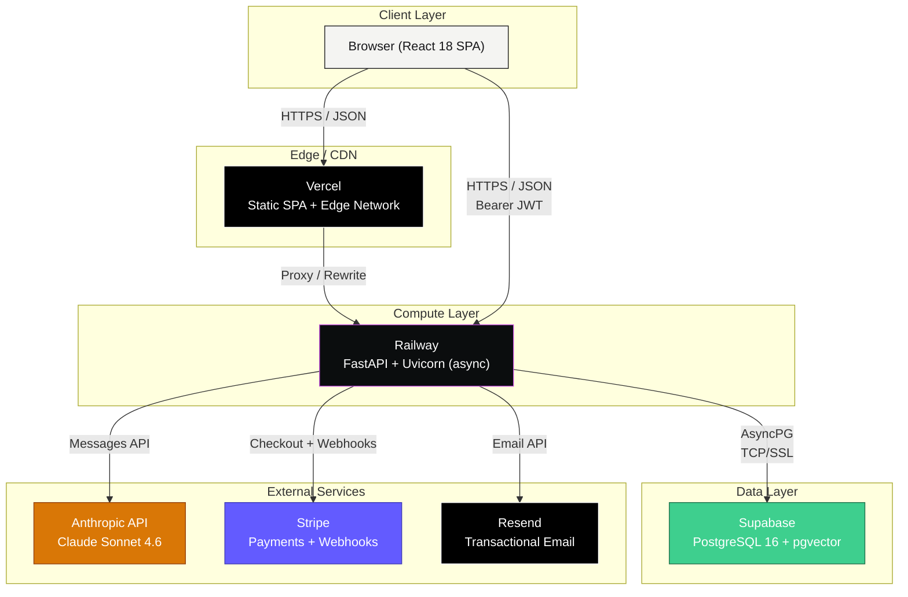
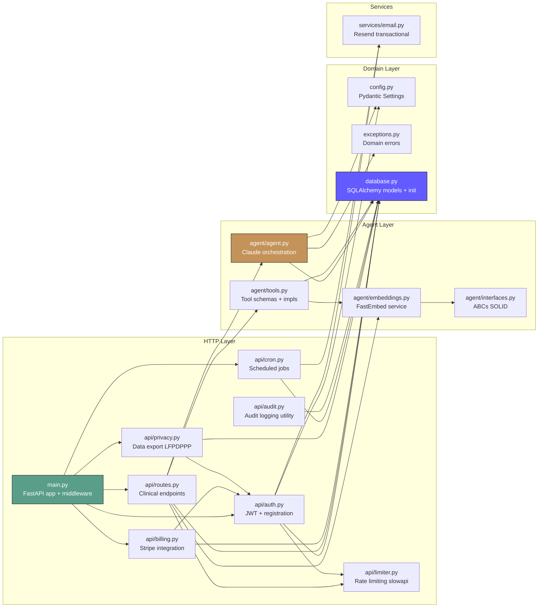
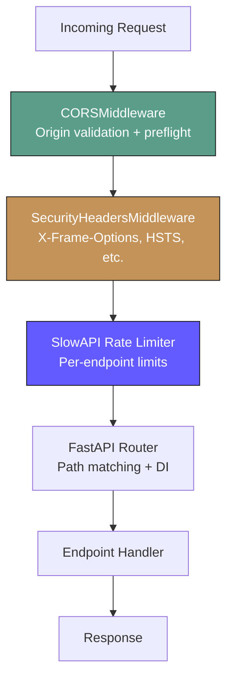
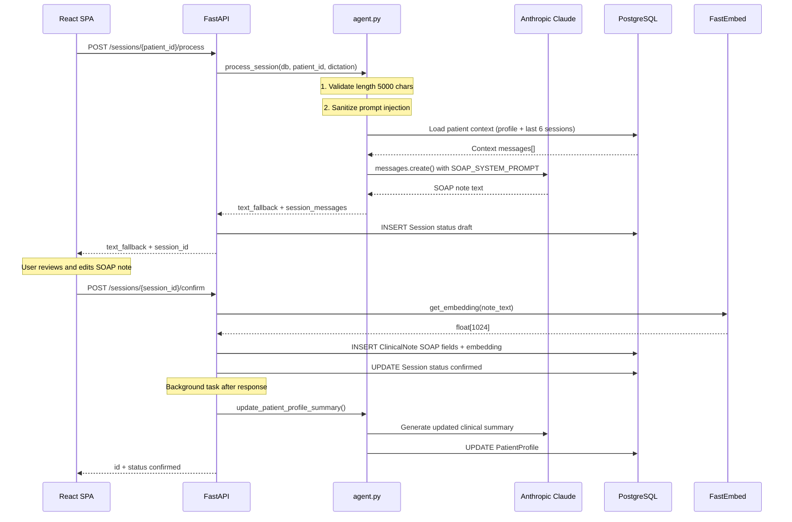
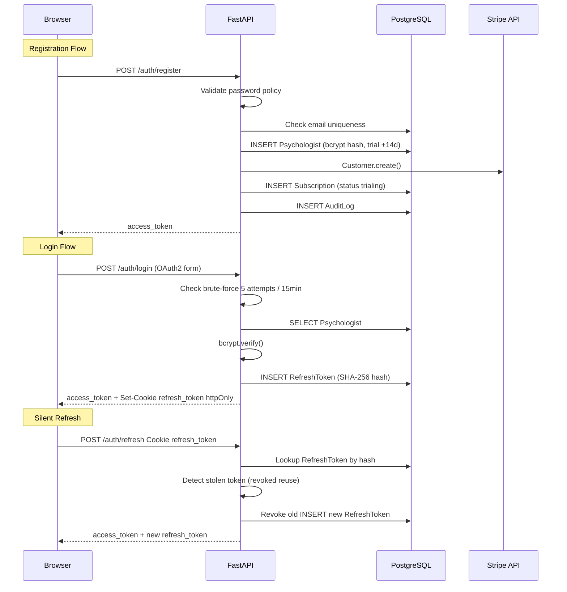
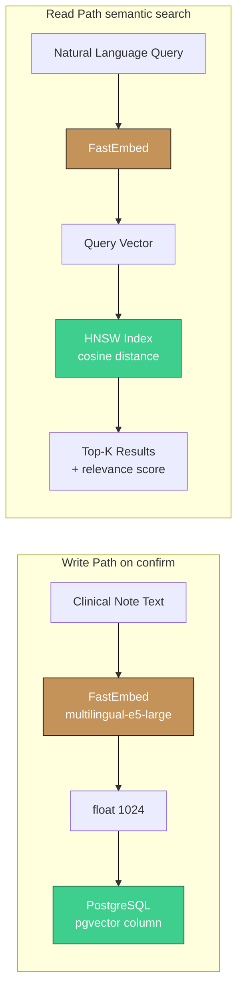
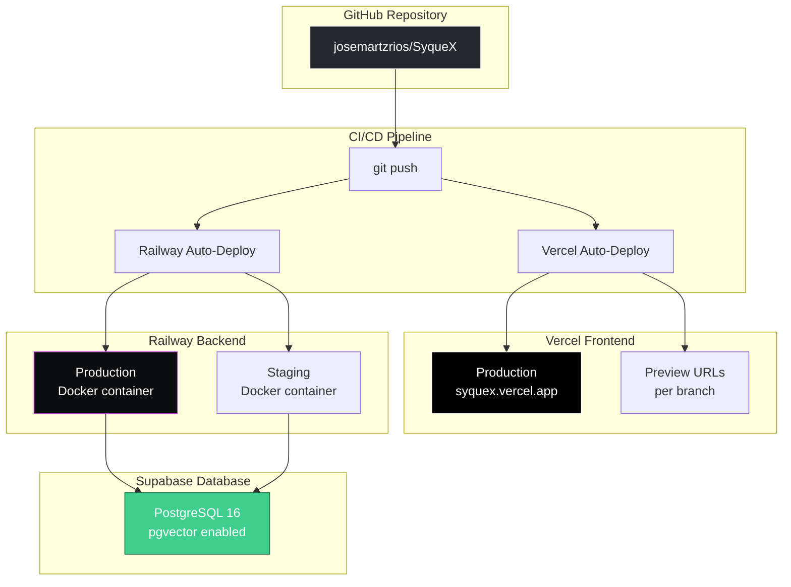
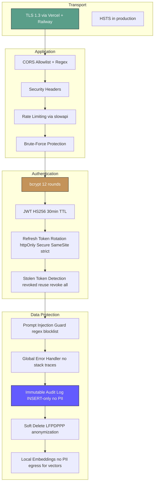

# SyqueX — System Architecture Document

> **Version:** 1.0.0 · **Last Updated:** 2026-04-16 · **Status:** Pre-Production  
> **Classification:** Internal Engineering · **Audience:** Engineering, DevOps, Security Auditors

---

## 1. Executive Summary

SyqueX is a **clinical AI assistant for mental health professionals** (psychologists and psychiatrists). The platform transforms free-form session dictations into structured **SOAP clinical notes** using Anthropic Claude, stores them with **vector embeddings** for semantic search, and tracks **patient evolution** over time through AI-powered analysis.

### Key Capabilities

| Capability | Description |
|---|---|
| **Dictation → SOAP** | Free-text dictation is processed by Claude into structured Subjective/Objective/Assessment/Plan notes |
| **Semantic History Search** | pgvector HNSW indexes enable cosine-similarity search across all clinical notes |
| **Patient Evolution Tracking** | Longitudinal AI analysis across sessions detects recurring themes, risk factors, and progress |
| **LFPDPPP Compliance** | Audit logging, data export, soft-delete, and local embeddings (no data egress for vectors) |
| **SaaS Billing** | Stripe-powered trial → subscription lifecycle with webhook-driven state management |

---

## 2. High-Level System Topology



### Technology Decision Matrix

| Layer | Technology | Why |
|---|---|---|
| **Frontend** | React 18 + Vite | Fast HMR, minimal bundle, proven ecosystem |
| **Styling** | Tailwind CSS (CDN) | Rapid prototyping without build pipeline overhead |
| **Backend** | FastAPI + Uvicorn | Async-native, Pydantic validation, OpenAPI auto-docs |
| **ORM** | SQLAlchemy 2.0 (async) | Mature, type-safe, asyncpg driver for zero-copy I/O |
| **Database** | PostgreSQL 16 + pgvector | ACID compliance + native vector similarity search |
| **LLM** | Anthropic Claude Sonnet 4.6 | Best-in-class clinical reasoning, tool_use API |
| **Embeddings** | FastEmbed (intfloat/multilingual-e5-large) | Local inference — no PII egress (LFPDPPP compliant) |
| **Auth** | JWT (PyJWT) + bcrypt + httpOnly cookies | Stateless access, secure refresh rotation |
| **Payments** | Stripe Checkout + Webhooks | PCI-compliant, MXN support, idempotent webhooks |
| **Email** | Resend | Simple transactional API, custom domain support |
| **Frontend Hosting** | Vercel | Automatic preview deployments, global CDN |
| **Backend Hosting** | Railway | Docker support, auto-deploy from GitHub, env management |
| **Database Hosting** | Supabase | Managed PostgreSQL with pgvector extension support |

---

## 3. Backend Architecture

### 3.1 Module Dependency Graph



### 3.2 File Inventory

| File | Lines | Role |
|---|---|---|
| `main.py` | 101 | App factory, CORS, security headers, error handlers, router mounting |
| `config.py` | 49 | Pydantic-settings: DB URL, API keys, clinical limits, Stripe/Resend config |
| `database.py` | 400 | 10 SQLAlchemy models, `init_db()` with idempotent migrations, pgvector HNSW index |
| `exceptions.py` | 60 | Domain error hierarchy with HTTP status mapping |
| `api/auth.py` | 526 | Register, login, refresh, logout, forgot/reset-password, brute-force protection |
| `api/routes.py` | 475 | Patients CRUD, sessions process/confirm/archive, conversations, profiles, search |
| `api/billing.py` | 130 | Stripe Checkout Sessions, webhook handler (idempotent), billing status |
| `api/privacy.py` | 64 | LFPDPPP data export endpoint |
| `api/cron.py` | 46 | Daily cron: trial-ending email notifications |
| `api/audit.py` | 41 | Audit log insertion utility |
| `api/limiter.py` | ~5 | slowapi Limiter singleton |
| `agent/agent.py` | 271 | System prompts (SOAP + Chat), patient context builder, Claude API calls, prompt injection guard |
| `agent/tools.py` | 169 | 5 tool schemas for Claude tool_use, semantic search implementation |
| `agent/embeddings.py` | 44 | FastEmbed wrapper (multilingual-e5-large, 1024d), thread-safe lazy init |
| `agent/interfaces.py` | 17 | `IEmbeddingService` and `BaseTool` ABCs |
| `services/email.py` | 54 | Welcome, reset, trial-ending emails via Resend |

### 3.3 Middleware Stack

Middleware executes **outside-in** (Starlette reverses `add_middleware` order):



**Security Headers Applied:**
- `X-Content-Type-Options: nosniff`
- `X-Frame-Options: DENY`
- `X-XSS-Protection: 1; mode=block`
- `Referrer-Policy: strict-origin-when-cross-origin`
- `Permissions-Policy: geolocation=(), microphone=(), camera=()`
- `Strict-Transport-Security: max-age=31536000` (production only)

---

## 4. Frontend Architecture

### 4.1 Component Tree

```mermaid
graph TB
    App["App.jsx<br/>941 lines - state orchestrator"]

    subgraph "Auth Screens"
        Login["LoginScreen"]
        Register["RegisterScreen"]
        Forgot["ForgotPasswordScreen"]
        Reset["ResetPasswordScreen"]
        Billing["BillingScreen"]
    end

    subgraph "Main Application"
        Trial["TrialBanner"]
        SidebarComp["Sidebar - mobile slide-over"]
        PatientSidebar["PatientSidebar - desktop"]
        PatientHeader["PatientHeader"]
        DictationPanel["DictationPanel"]
        SoapNote["SoapNoteDocument"]
        Evolucion["EvolucionPanel"]
        MobileEvolucion["MobileEvolucion"]
        MobileHistory["MobileHistoryChips"]
        MobileTabNav["MobileTabNav"]
        NoteReview["NoteReview"]
        ChatInput["ChatInput"]
        NewPatientModal["NewPatientModal"]
        PasswordStrength["PasswordStrength"]
    end

    subgraph "Data Layer"
        API["api.js<br/>HTTP client + auto-refresh"]
        Auth["auth.js<br/>Token lifecycle"]
    end

    App --> Login & Register & Forgot & Reset & Billing
    App --> Trial & SidebarComp & PatientSidebar & PatientHeader
    App --> DictationPanel & SoapNote & Evolucion
    App --> MobileEvolucion & MobileHistory & MobileTabNav
    App --> NewPatientModal
    DictationPanel --> ChatInput
    SoapNote --> NoteReview
    Register --> PasswordStrength
    App --> API
    API --> Auth

    style App fill:#5a9e8a,stroke:#18181b,color:#fff
    style API fill:#c4935a,stroke:#18181b,color:#fff
    style Auth fill:#635BFF,stroke:#18181b,color:#fff
```



### 4.2 State Management

The application uses **React built-in `useState` + `useEffect` + `useCallback`** — no external state library. All state lives at the `App.jsx` root and flows down via props.

| State Variable | Type | Purpose |
|---|---|---|
| `authScreen` | `{screen, resetToken?}` | Current authentication/routing screen |
| `billingStatus` | `object` | Trial/active/billing status from backend |
| `selectedPatientId` | `UUID` | Currently active patient |
| `messages` | `Message[]` | Chat/dictation message history |
| `currentSessionNote` | `NoteState` | Active SOAP note being generated/displayed |
| `sessionHistory` | `Session[]` | All sessions for selected patient |
| `conversations` | `Conversation[]` | Cross-patient conversation list |
| `desktopMode` | `'session' \| 'review'` | Desktop two-mode layout toggle |
| `evolutionMessages` | `Map<patientId, Message[]>` | Per-patient evolution chat history |
| `mobileTab` | `string` | Active mobile tab (dictar/nota/historial/evolucion) |

### 4.3 Responsive Layout Strategy

| Breakpoint | Layout |
|---|---|
| **Desktop** (`md+`, ≥768px) | 3-column: PatientSidebar (240px) + Split work area (Dictation 320px + Note flex) |
| **Mobile** (`<md`) | Single column with tab navigation: Dictar / Nota / Historial / Evolucion |

---

## 5. Core Data Flows

### 5.1 Dictation to SOAP Note Pipeline



### 5.2 Authentication Lifecycle



### 5.3 Embedding and RAG Pipeline



**Key Design Decision:** Embeddings are generated **locally** via FastEmbed (BAAI/intfloat model) rather than via OpenAI API. This ensures **zero clinical data egress** for vector operations, critical for LFPDPPP compliance. Only dictation text is sent to Anthropic (necessary for note generation).

---

## 6. Infrastructure and Deployment

### 6.1 Deployment Topology



### 6.2 Branch Strategy

| Branch | Environment | Deployment |
|---|---|---|
| `main` | Production | Auto to Vercel prod + Railway prod |
| `dev` | Staging | Auto to Vercel preview + Railway staging |
| `feature/*` | Preview | Vercel preview URL per branch |
| `hotfix/*` | Emergency | Merge to `main`, backport to `dev` |

### 6.3 Environment Variables

| Variable | Service | Required | Description |
|---|---|---|---|
| `DATABASE_URL` | Railway | Yes | `postgresql+asyncpg://...` connection string |
| `ANTHROPIC_API_KEY` | Railway | Yes | Claude API authentication |
| `SECRET_KEY` | Railway | Yes | JWT signing key (min 64 random chars) |
| `STRIPE_SECRET_KEY` | Railway | Yes | Stripe API key |
| `STRIPE_WEBHOOK_SECRET` | Railway | Yes | Webhook signature verification |
| `STRIPE_PRICE_ID` | Railway | Yes | Subscription price identifier |
| `RESEND_API_KEY` | Railway | Yes | Transactional email API key |
| `ALLOWED_ORIGINS` | Railway | Recommended | CORS origins (comma-separated) |
| `ENVIRONMENT` | Railway | Yes | `development` / `staging` / `production` |
| `CRON_SECRET` | Railway | Yes | Bearer token for cron endpoint |
| `VITE_API_URL` | Vercel | Yes | Backend URL for the SPA |

---

## 7. Security Architecture

### 7.1 Security Layers



### 7.2 Known Technical Debt

| Item | Severity | Description |
|---|---|---|
| In-memory brute-force tracking | Medium | `_failed_attempts` dict resets on restart. Migrate to Redis. |
| CORS env var not loading on Railway | Low | Workaround active via `allow_origin_regex`. Root cause unknown. |
| OpenAPI docs hidden but not auth-gated | Info | Docs disabled in prod via `docs_url=None`; consider BasicAuth for staging. |
| `datetime.utcnow()` deprecation | Low | Some models use `datetime.utcnow()` instead of `datetime.now(UTC)`. |

---

## 8. Testing Infrastructure

### 8.1 Backend Tests

| Test File | Coverage Area | Size |
|---|---|---|
| `tests/test_api_routes.py` | All clinical endpoints, pagination, UUID validation | ~39K |
| `tests/test_auth_register.py` | Registration flow, email uniqueness, password policy | ~2.7K |
| `tests/test_auth_refresh.py` | Token refresh, rotation, theft detection | ~672 |
| `tests/test_auth_forgot_reset.py` | Password reset lifecycle | ~2.3K |
| `tests/test_agent_process.py` | Agent orchestration, LLM mocking | ~19K |
| `tests/test_agent_sanitize.py` | Prompt injection detection | ~4.5K |
| `tests/test_agent_embeddings.py` | Embedding service, error handling | ~4.9K |
| `tests/test_config.py` | Settings validation | ~3.4K |
| `tests/test_exceptions.py` | Domain error hierarchy | ~4.9K |
| `tests/test_health.py` | Health check endpoint | ~722 |

### 8.2 Frontend Tests

| Test File | Coverage Area |
|---|---|
| `App.test.jsx` | App component logic, state transitions |
| `App.integration.test.jsx` | Full integration flows |
| `ChatInput.test.jsx` | Input validation, submission |
| `DictationPanel.test.jsx` | Dictation UI |
| `EvolucionPanel.test.jsx` | Evolution chat |
| `LoginScreen.test.jsx` | Login form |
| `NewPatientModal.test.jsx` | Patient creation modal |
| `NoteReview.test.jsx` | Note review component |
| `PasswordStrength.test.jsx` | Password policy UI |
| `PatientHeader.test.jsx` | Header modes |
| `PatientSidebar.test.jsx` | Sidebar interactions |
| `RegisterScreen.test.jsx` | Registration form |
| `Sidebar.test.jsx` | Mobile sidebar |
| `SoapNoteDocument.test.jsx` | SOAP note rendering and editing |

---

## 9. Appendices

### A. API Base URL Pattern
```
{VITE_API_URL}/api/v1/{resource}
```

### B. Router Mounting Order
```python
app.include_router(auth_router,    prefix="/api/v1")           # /api/v1/auth/*
app.include_router(billing_router, prefix="/api/v1/billing")   # /api/v1/billing/*
app.include_router(cron_router,    prefix="/api/v1/cron")      # /api/v1/cron/*
app.include_router(privacy_router, prefix="/api/v1/privacy")   # /api/v1/privacy/*
app.include_router(router,         prefix="/api/v1")           # /api/v1/* (clinical)
```

### C. Clinical Configuration Defaults
```python
MAX_DICTATION_LENGTH  = 5000   # characters
MAX_SESSIONS_CONTEXT  = 6      # sessions passed to Claude
EMBEDDING_DIMENSIONS  = 1024   # FastEmbed vector size
ACCESS_TOKEN_EXPIRE   = 30     # minutes
REFRESH_TOKEN_EXPIRE  = 7      # days
BCRYPT_ROUNDS         = 12
```
