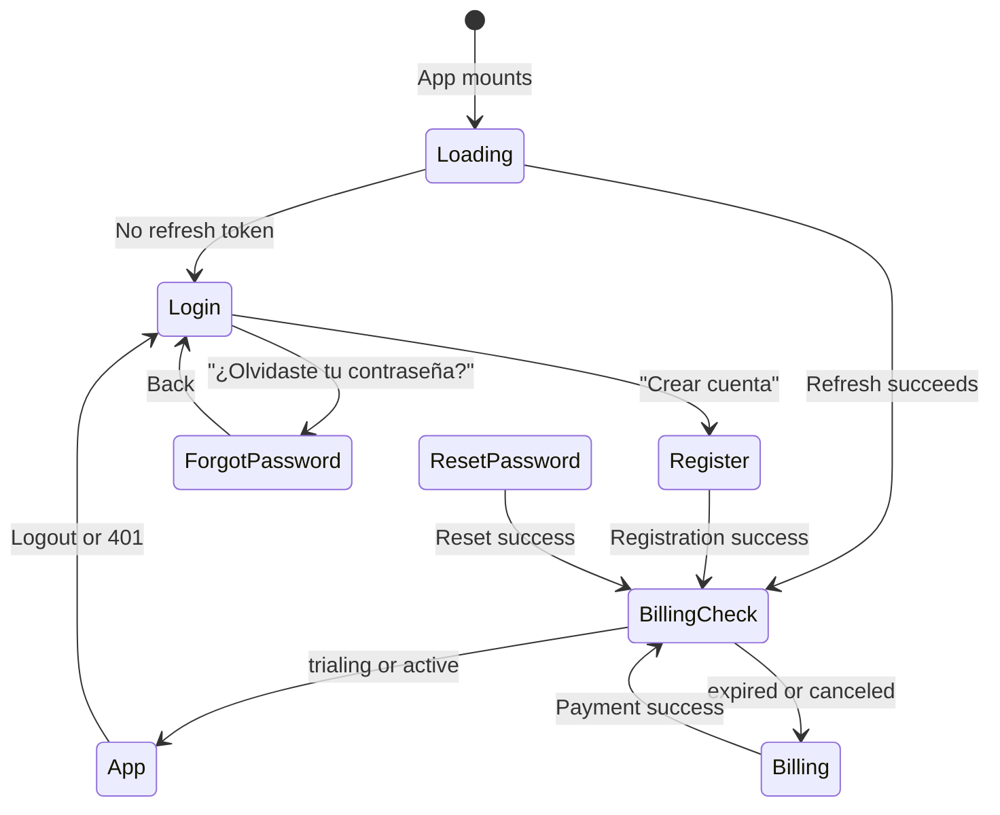
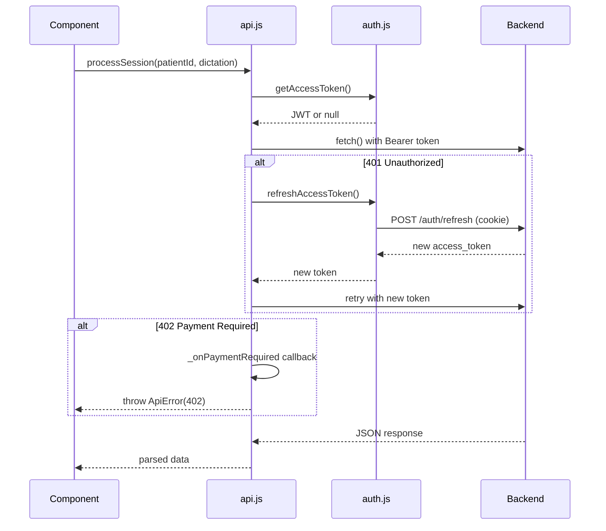

# SyqueX — Frontend Component Guide

> **Version:** 1.0.0 · **Last Updated:** 2026-04-16  
> **Stack:** React 18 + Vite 5 · **Styling:** Tailwind CSS (CDN) · **Testing:** Vitest + Testing Library

---

## 1. Application Architecture

### 1.1 Design Philosophy

SyqueX follows a **centralized state orchestrator** pattern:

- **`App.jsx`** is the single source of truth — all state, API calls, and routing decisions live here
- **Components are presentational** — they receive data via props and communicate upward via callbacks
- **No routing library** — screen management is handled via `authScreen` state + `window.history.pushState`
- **No state management library** — React's built-in `useState`, `useEffect`, `useCallback`, and `useRef` suffice for current complexity

### 1.2 File Structure

```
frontend/
├── index.html              # Entry point — loads Tailwind CDN, Google Fonts (Inter, Lora)
├── vite.config.js           # Vite config with React plugin
├── vercel.json              # Vercel deployment config
├── package.json             # Dependencies: react 18, vitest 4
└── src/
    ├── main.jsx             # React DOM root mount
    ├── App.jsx              # 941-line state orchestrator (all state + layout)
    ├── api.js               # HTTP client with JWT auto-refresh
    ├── auth.js              # Token lifecycle (memory-only access token)
    ├── test-setup.js         # Vitest setup
    └── components/
        ├── LoginScreen.jsx         # Auth: email/password login
        ├── RegisterScreen.jsx      # Auth: registration with consent
        ├── ForgotPasswordScreen.jsx # Auth: forgot password
        ├── ResetPasswordScreen.jsx  # Auth: reset with token
        ├── BillingScreen.jsx       # Billing: trial/subscription status
        ├── TrialBanner.jsx         # Banner: trial days remaining
        ├── PasswordStrength.jsx    # Shared: password policy indicator
        ├── Sidebar.jsx             # Mobile: slide-over patient list
        ├── PatientSidebar.jsx      # Desktop: always-visible patient list
        ├── PatientHeader.jsx       # Patient name + session/review mode toggle
        ├── DictationPanel.jsx      # Left panel: dictation input area
        ├── ChatInput.jsx           # Text input with send button
        ├── SoapNoteDocument.jsx    # SOAP note viewer/editor/confirmer
        ├── NoteReview.jsx          # Legacy note review component
        ├── NewPatientModal.jsx     # Modal: create patient form
        ├── EvolucionPanel.jsx      # Desktop: evolution AI chat
        ├── MobileEvolucion.jsx     # Mobile: evolution AI chat
        ├── MobileHistoryChips.jsx  # Mobile: session history chips
        └── MobileTabNav.jsx        # Mobile: bottom tab navigation
```

---

## 2. Screen Flow



### URL-Based Screen Detection

On mount, `auth.js:getScreenFromUrl()` inspects the current URL:

| URL Pattern | Screen |
|---|---|
| `/?token=...` | `reset-password` |
| `/registro` | `register` |
| `/forgot-password` | `forgot-password` |
| `/billing` | `billing-check` |
| `/billing?success=true` | `billing-success` |
| `/` (default) | `loading` → attempt silent refresh |

---

## 3. Component Reference

### 3.1 Auth Components

#### `LoginScreen`

OAuth2 login form with email/password.

| Prop | Type | Description |
|---|---|---|
| `onSuccess` | `() => void` | Called after successful login |
| `onRegister` | `() => void` | Navigate to registration |
| `onForgotPassword` | `() => void` | Navigate to forgot password |

---

#### `RegisterScreen`

Registration form with password policy validation and consent checkboxes.

| Prop | Type | Description |
|---|---|---|
| `onSuccess` | `() => void` | Called after successful registration |
| `onLogin` | `() => void` | Navigate back to login |

**Includes:** `PasswordStrength` component for real-time password validation feedback.

**Consent Fields:**
- Privacy policy acceptance (required)
- Terms & conditions acceptance (required)
- Privacy version tracking (`1.0`)
- Terms version tracking (`1.0`)

---

#### `ForgotPasswordScreen`

Email input for password reset request.

| Prop | Type | Description |
|---|---|---|
| `onBack` | `() => void` | Navigate back to login |

---

#### `ResetPasswordScreen`

New password input with token from URL.

| Prop | Type | Description |
|---|---|---|
| `resetToken` | `string` | One-time token from email link |
| `onSuccess` | `() => void` | Called after successful reset |
| `onInvalidToken` | `() => void` | Redirect to forgot password |

---

#### `BillingScreen`

Subscription status and checkout activation.

| Prop | Type | Description |
|---|---|---|
| `onActivated` | `() => void` | Called after successful payment verification |

---

### 3.2 Layout Components

#### `PatientSidebar` (Desktop)

Always-visible left sidebar showing patient/conversation list.

| Prop | Type | Description |
|---|---|---|
| `conversations` | `Conversation[]` | List of patient conversations |
| `selectedPatientId` | `string` | Currently active patient UUID |
| `onSelectConversation` | `(conv) => void` | Select a conversation |
| `onDeleteConversation` | `(sessionId, patientId) => void` | Archive a conversation |
| `onNewPatient` | `() => void` | Open new patient modal |
| `onLogout` | `() => void` | Trigger logout |

**Width:** 240px fixed, background `#f4f4f2`

---

#### `Sidebar` (Mobile)

Slide-over panel that overlays the mobile UI.

| Prop | Type | Description |
|---|---|---|
| `open` | `boolean` | Visibility state |
| `onClose` | `() => void` | Close the sidebar |
| `conversations` | `Conversation[]` | List of patient conversations |
| `onSelectConversation` | `(conv) => void` | Select a conversation |
| `onDeleteConversation` | `(sessionId, patientId) => void` | Archive a conversation |
| `onLogout` | `() => void` | Trigger logout |

---

#### `PatientHeader`

Displays patient name, session count, and desktop mode toggle.

| Prop | Type | Description |
|---|---|---|
| `patientName` | `string \| null` | Patient name or null |
| `sessionCount` | `number` | Number of confirmed sessions |
| `mode` | `'session' \| 'review'` | Current desktop mode |
| `onModeChange` | `(mode) => void` | Mode change handler |
| `compact` | `boolean` | Mobile compact variant |

**Desktop Mode Toggle:** Segmented control with "Sesión" and "Revisión" options.

---

### 3.3 Clinical Components

#### `DictationPanel`

Left-side panel for composing dictation text.

| Prop | Type | Description |
|---|---|---|
| `onGenerate` | `(dictation: string) => void` | Submit dictation for SOAP generation |
| `loading` | `boolean` | Show loading state during processing |

**Contains:** `ChatInput` component for text entry.

---

#### `ChatInput`

Reusable text input with submit button.

| Prop | Type | Description |
|---|---|---|
| `onSend` | `(text: string) => void` | Submit handler |
| `placeholder` | `string` | Placeholder text |
| `disabled` | `boolean` | Disable input |
| `loading` | `boolean` | Show loading indicator |

---

#### `SoapNoteDocument`

The primary SOAP note display, edit, and confirmation component.

| Prop | Type | Description |
|---|---|---|
| `noteData` | `NoteData` | SOAP note data from API |
| `onConfirm` | `() => void` | Called after successful confirmation |
| `readOnly` | `boolean` | Disable editing (confirmed notes) |
| `compact` | `boolean` | Compact view for review mode |

**NoteData Shape:**
```javascript
{
  clinical_note: {
    structured_note: { subjective, objective, assessment, plan },
    detected_patterns: string[],
    alerts: string[],
    session_id: string
  },
  text_fallback: string
}
```

**Behavior:**
1. Parses `text_fallback` into SOAP sections using regex
2. Renders editable fields for each section
3. On confirm, calls `POST /sessions/{id}/confirm` with edited data
4. Transitions to read-only after confirmation

---

#### `EvolucionPanel` (Desktop)

AI-powered evolution chat for patient longitudinal analysis.

| Prop | Type | Description |
|---|---|---|
| `patient` | `{id, name}` | Current patient |
| `messages` | `Message[]` | Chat history for this patient |
| `profile` | `ProfileData` | Patient clinical profile |
| `loading` | `boolean` | Initial data loading |
| `onSend` | `(text: string) => void` | Send evolution query |
| `sending` | `boolean` | Message being processed |
| `error` | `string \| null` | Error message |

---

#### `MobileEvolucion`

Mobile-optimized version of the evolution panel.

| Prop | Type | Description |
|---|---|---|
| Same as `EvolucionPanel` | | Mobile-specific layout |

---

### 3.4 Utility Components

#### `TrialBanner`

Top banner showing trial days remaining with activation button.

| Prop | Type | Description |
|---|---|---|
| `daysRemaining` | `number` | Days left in trial |
| `onActivate` | `() => void` | Open Stripe checkout |

---

#### `NewPatientModal`

Modal dialog for creating a new patient.

| Prop | Type | Description |
|---|---|---|
| `onSave` | `(patient) => void` | Called with created patient data |
| `onCancel` | `() => void` | Close modal |

**Fields:** Name, date of birth, diagnosis tags, risk level.

---

#### `PasswordStrength`

Real-time password policy validation indicator.

| Prop | Type | Description |
|---|---|---|
| `password` | `string` | Current password value |

**Policy Rules Checked:**
- Minimum 8 characters
- At least 1 uppercase letter
- At least 1 number

---

## 4. Data Layer

### 4.1 API Client (`api.js`)

The API client handles authentication, token refresh, and error standardization.



### 4.2 Auth Module (`auth.js`)

Token lifecycle management with anti-race-condition refresh queue.

| Function | Purpose |
|---|---|
| `getAccessToken()` | Return current in-memory token |
| `setAccessToken(token)` | Store token in memory |
| `clearAccessToken()` | Clear token (logout) |
| `refreshAccessToken(apiBase)` | Execute refresh with queue dedup |
| `getScreenFromUrl()` | Determine initial screen from URL |
| `navigateTo(path)` | pushState without page reload |

**Refresh Queue:** If multiple components trigger a refresh simultaneously, only ONE network request is made. All callers receive the same result via a Promise queue.

---

## 5. Design System

### 5.1 Color Palette

| Token | Hex | Usage |
|---|---|---|
| `parchment` | `#ffffff` | Main background |
| `parchment-dark` | `#f4f4f2` | Sidebar, muted backgrounds |
| `sage` | `#5a9e8a` | Primary accent, confirmed states, CTAs |
| `sage-dark` | darker variant | Hover state for sage |
| `amber` | `#c4935a` | Secondary accent, pending states, streaming |
| `ink` | `#18181b` | Primary text |
| `ink-secondary` | muted | Body text |
| `ink-tertiary` | lighter | Captions, timestamps |
| `ink-muted` | lightest | Placeholder, disabled |

### 5.2 Typography

| Context | Font | Weight | Size |
|---|---|---|---|
| UI labels, navigation | Inter (sans-serif) | 400-700 | 10-15px |
| Clinical note content | Lora / Georgia (serif) | 400-600 | 13-14px |
| SOAP section headers | Inter (sans-serif) | 700 | 10px, uppercase, tracking |

### 5.3 Layout Breakpoints

| Breakpoint | Class | Layout |
|---|---|---|
| `< 768px` | default | Mobile: single column + tabs |
| `≥ 768px` | `md:` | Desktop: 3-column split view |

### 5.4 Design Principles

1. **Depth via color, not shadows** — surface color shifts differentiate planes
2. **Clinical warmth** — sage/amber accents over cold blues
3. **Serif for notes, sans for UI** — note text uses Georgia/Lora for a clinical document feel
4. **SOAP labels** — small caps, colored by state (sage=done, amber=streaming, muted=pending)
5. **Minimal chrome** — no cards/borders for SOAP sections, just spacing and weight

---

## 6. Testing

### 6.1 Test Stack

```json
{
  "test runner": "vitest 4.x",
  "DOM environment": "jsdom 29.x",
  "component testing": "@testing-library/react 16.x",
  "user simulation": "@testing-library/user-event 14.x",
  "assertions": "@testing-library/jest-dom 6.x"
}
```

### 6.2 Running Tests

```bash
cd frontend
npm test              # Run all tests in watch mode
npm test -- --run     # Run once (CI mode)
```

### 6.3 Test File Conventions

- Test files are colocated with components: `Component.jsx` + `Component.test.jsx`
- Integration tests live in `src/`: `App.integration.test.jsx`
- Mock API calls at the `fetch` level (no MSW currently)

### 6.4 Test Coverage Map

| Component | Test File | Key Scenarios |
|---|---|---|
| `App` | `App.test.jsx` | State transitions, helper functions |
| `App` | `App.integration.test.jsx` | Full flows: login → dictation → confirm |
| `ChatInput` | `ChatInput.test.jsx` | Empty submit prevention, callback invocation |
| `DictationPanel` | `DictationPanel.test.jsx` | Rendering, generate button |
| `EvolucionPanel` | `EvolucionPanel.test.jsx` | Message rendering, send flow, loading states |
| `LoginScreen` | `LoginScreen.test.jsx` | Form validation, submission |
| `NewPatientModal` | `NewPatientModal.test.jsx` | Form fields, save/cancel, validation |
| `NoteReview` | `NoteReview.test.jsx` | Note rendering, edit toggle |
| `PasswordStrength` | `PasswordStrength.test.jsx` | Policy rules visual feedback |
| `PatientHeader` | `PatientHeader.test.jsx` | Mode toggle, compact variant |
| `PatientSidebar` | `PatientSidebar.test.jsx` | Patient list, selection, new patient |
| `RegisterScreen` | `RegisterScreen.test.jsx` | Registration form, consent checkboxes |
| `Sidebar` | `Sidebar.test.jsx` | Open/close, conversation list, logout |
| `SoapNoteDocument` | `SoapNoteDocument.test.jsx` | SOAP parsing, editing, confirmation |
