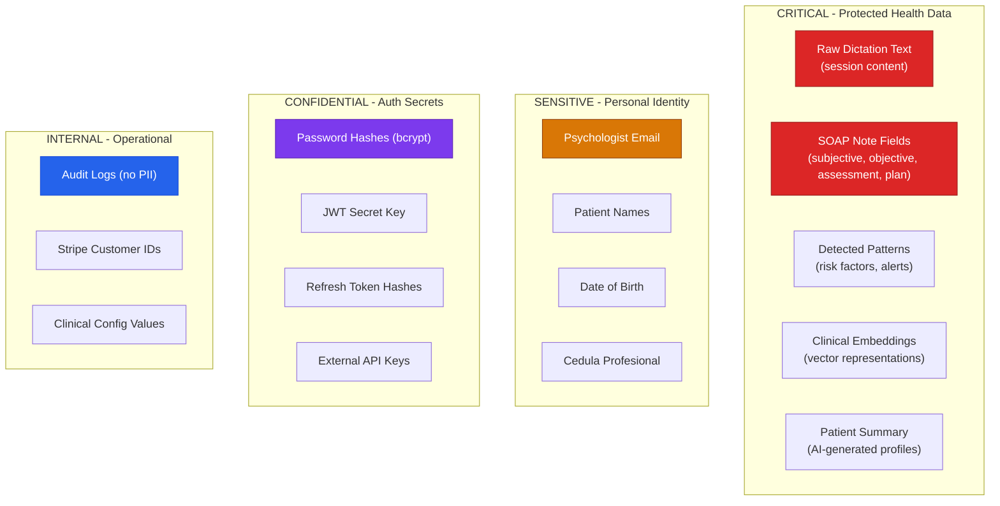
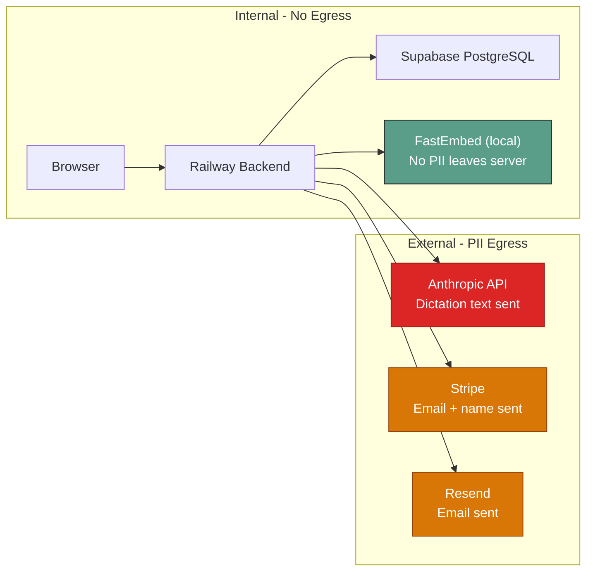
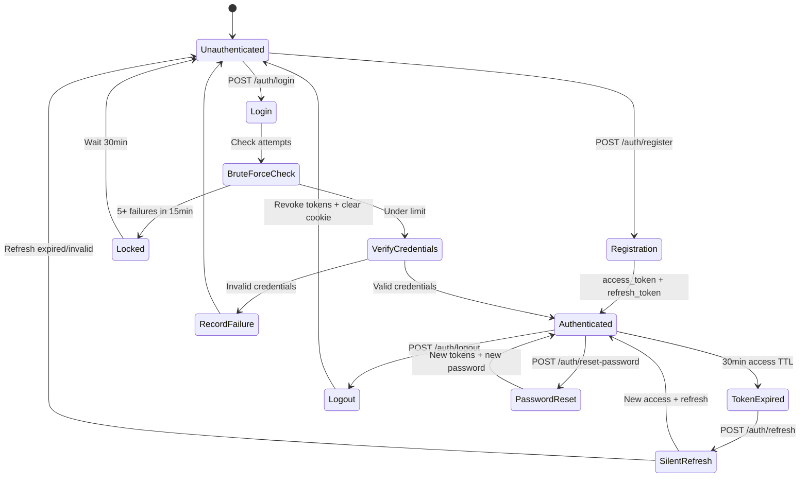

# SyqueX — Security & Compliance Reference

> **Version:** 1.0.0 · **Last Updated:** 2026-04-16  
> **Regulatory Framework:** LFPDPPP (Ley Federal de Protección de Datos Personales en Posesión de los Particulares)  
> **Standards:** OWASP Top 10 (2021)

---

## 1. Threat Model

### 1.1 Data Classification



### 1.2 Attack Surface

| Surface | Threats | Mitigations |
|---|---|---|
| **API endpoints** | Injection, IDOR, data exfiltration | Input validation (Pydantic), UUID parsing, ownership checks |
| **Authentication** | Brute force, credential stuffing, token theft | Rate limiting, bcrypt, refresh rotation, stolen token detection |
| **LLM interface** | Prompt injection, data leakage | Regex blocklist, system prompt boundaries, output sanitization |
| **Database** | SQL injection, unauthorized access | Parameterized queries (SQLAlchemy), asyncpg driver, SSL |
| **Browser** | XSS, CSRF, clickjacking | Security headers, httpOnly cookies, SameSite strict |
| **Infrastructure** | Misconfiguration, exposed secrets | Env var management, docs disabled in prod, HSTS |

---

## 2. OWASP Top 10 Coverage

### A01:2021 — Broken Access Control

| Control | Implementation | Status |
|---|---|---|
| JWT authentication | All protected endpoints require valid Bearer token | Done |
| Token expiration | Access: 30min, Refresh: 7 days | Done |
| Resource ownership | Patients scoped to psychologist | Partial (multi-tenant queries need audit) |
| Soft delete | `deleted_at` column prevents data resurrection | Done |
| CORS | Allowlist + regex for Vercel domains | Done |
| Docs disabled in prod | `docs_url=None` when `ENVIRONMENT=production` | Done |

### A02:2021 — Cryptographic Failures

| Control | Implementation | Status |
|---|---|---|
| Password hashing | bcrypt, 12 rounds | Done |
| Token hashing | SHA-256 for refresh and reset tokens | Done |
| Transport encryption | TLS via Vercel and Railway | Done |
| HSTS | `Strict-Transport-Security` in production | Done |
| No secrets in code | `.env` files, env vars on hosting platforms | Done |

### A03:2021 — Injection

| Control | Implementation | Status |
|---|---|---|
| SQL injection | SQLAlchemy ORM with parameterized queries | Done |
| Prompt injection | Regex blocklist in `_sanitizar_dictado()` | Done |
| Input validation | Pydantic models for all request bodies | Done |
| UUID validation | `_parse_uuid()` with domain error on invalid format | Done |

**Prompt Injection Patterns Blocked:**
```
ignore (previous|all|prior) instructions
system prompt
jailbreak
you are now
forget your
new instructions
[INST]
<|im_start|>
<|im_end|>
disregard (all|previous)
override (your|the) (instructions|rules)
```

### A04:2021 — Insecure Design

| Control | Implementation | Status |
|---|---|---|
| Rate limiting | slowapi per-endpoint (30/hour on `/process`, 3/hour on password reset) | Done |
| Brute-force protection | 5 attempts per email per 15-minute window, 30-minute lockout | Done |
| Email enumeration prevention | Forgot-password always returns success + constant-time delay | Done |
| Timing attack prevention | Constant-time password comparison (passlib) | Done |

### A05:2021 — Security Misconfiguration

| Control | Implementation | Status |
|---|---|---|
| Security headers | X-Frame-Options DENY, nosniff, XSS-Protection | Done |
| Server info suppressed | X-Powered-By and Server headers removed | Done |
| Debug info in errors | Global error handler returns generic message | Done |
| Stack traces hidden | `exc_info=True` only in logs, not in responses | Done |
| ReDoc disabled | `redoc_url=None` | Done |

### A07:2021 — Identification and Authentication Failures

| Control | Implementation | Status |
|---|---|---|
| Password policy | Minimum 8 chars, 1 uppercase, 1 number | Done |
| Refresh token rotation | New token on each use, old token revoked | Done |
| Stolen token detection | Revoked token reuse triggers full token revocation | Done |
| httpOnly cookies | Refresh token inaccessible to JavaScript | Done |
| SameSite strict | Prevents cross-site request forgery | Done |
| Secure flag | Cookie only sent over HTTPS in production | Done |

### A09:2021 — Security Logging and Monitoring Failures

| Control | Implementation | Status |
|---|---|---|
| Audit log table | All auth events (register, login, logout, password reset) | Done |
| Structured logging | JSON-format log events with event type and psychologist ID | Done |
| No PII in audit logs | Only IDs and counters in `extra` JSONB | Done |
| Failed login logging | Warning-level log for brute-force attempts | Done |

---

## 3. LFPDPPP Compliance

### 3.1 Requirements Matrix

| LFPDPPP Requirement | Implementation | Article |
|---|---|---|
| **Privacy Notice** | Consent timestamps (`accepted_privacy_at`, `privacy_version`) | Art. 8 |
| **Consent** | Explicit checkboxes in registration with version tracking | Art. 8 |
| **Data Access Rights (ARCO)** | `GET /privacy/export` endpoint for full data download | Art. 28 |
| **Data Minimization** | Audit logs store only IDs, never clinical content | Art. 13 |
| **Deletion Rights** | Soft-delete with `deleted_at` column (anonymization path) | Art. 34 |
| **Security Measures** | Encryption, access control, audit logging | Art. 19 |
| **Data Processor Controls** | Anthropic API for note generation only; embeddings local | Art. 38 |

### 3.2 Data Flow and PII Egress



**PII Egress Summary:**

| Service | Data Sent | Purpose | Risk Mitigation |
|---|---|---|---|
| **Anthropic** | Raw dictation text, patient context | SOAP note generation | Anthropic zero-retention API policy; no patient names in system prompt |
| **Stripe** | Email, name, psychologist ID | Payment processing | PCI-DSS compliant; minimal metadata |
| **Resend** | Email, name, trial dates | Transactional emails | SPF/DKIM authenticated; minimal data |
| **FastEmbed** | None (runs locally) | Vector embeddings | Zero egress by design |

### 3.3 Audit Events Tracked

| Event | Entity | Triggered By |
|---|---|---|
| `register` | psychologist | POST /auth/register |
| `login` (implicit via structured log) | psychologist | POST /auth/login |
| `logout` | psychologist | POST /auth/logout |
| `password_reset_requested` | psychologist | POST /auth/forgot-password |
| `password_reset_completed` | psychologist | POST /auth/reset-password |

---

## 4. Authentication Architecture Detail



### Token Storage Strategy

| Token | Storage | Lifetime | Access |
|---|---|---|---|
| Access Token (JWT) | JavaScript memory (`_accessToken` variable) | 30 minutes | Sent in `Authorization` header |
| Refresh Token | httpOnly cookie | 7 days | Sent automatically via `credentials: 'include'` |
| Password Reset Token | One-time URL parameter | 60 minutes | User clicks email link |

> [!IMPORTANT]
> The access token is **never** stored in `localStorage` or `sessionStorage`. This prevents XSS token theft. The variable is lost on page refresh — the app silently refreshes via the httpOnly cookie on load.

---

## 5. Security Hardening Recommendations (Pre-Production)

### 5.1 Critical (Must Fix)

| Item | Description | Effort |
|---|---|---|
| Migrate brute-force to Redis | In-memory dict resets on deploy/restart | 2h |
| Add multi-tenant ownership checks | Verify `psychologist_id` on all patient/session queries | 4h |
| Generate production SECRET_KEY | Current dev key must not reach production | 5min |
| Verify CORS in Railway logs | Check `[CORS_DEBUG]` output matches expected origins | 30min |

### 5.2 High Priority

| Item | Description | Effort |
|---|---|---|
| Content Security Policy header | Add CSP to prevent XSS | 1h |
| Rate limit on registration | Prevent mass account creation | 30min |
| Add `Cache-Control: no-store` on API responses | Prevent caching of clinical data | 30min |
| Implement ARCO deletion endpoint | Complete the soft-delete → anonymize pipeline | 4h |

### 5.3 Medium Priority

| Item | Description | Effort |
|---|---|---|
| Replace `datetime.utcnow()` | Use `datetime.now(UTC)` consistently | 1h |
| Add request ID correlation | Trace requests across logs | 2h |
| Implement audit log for clinical operations | Log note creation, patient access | 3h |
| Add Sentry or equivalent error tracking | Proactive error detection | 2h |
